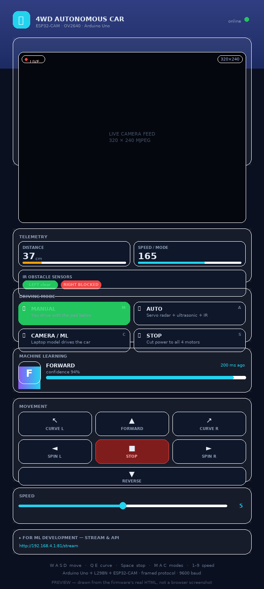
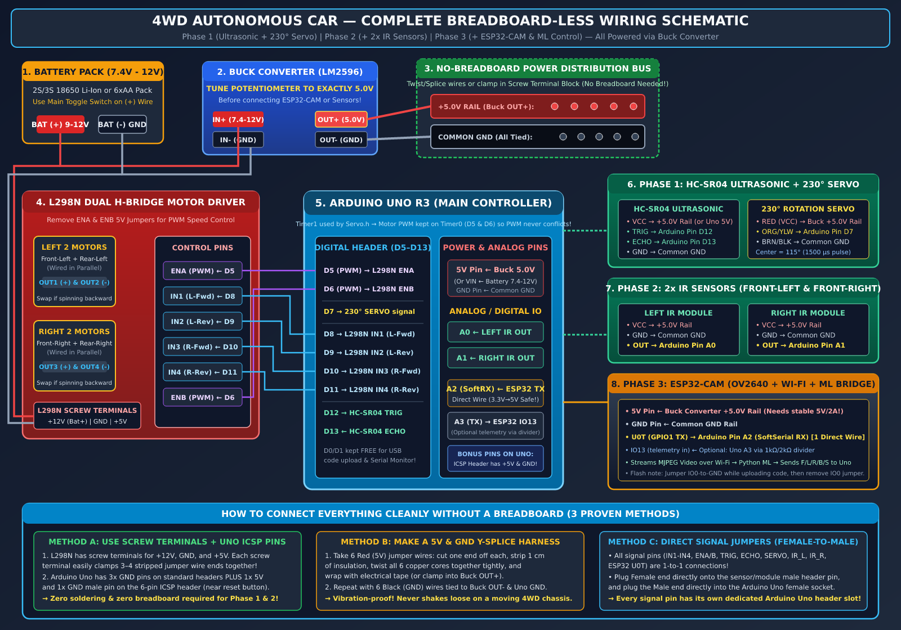
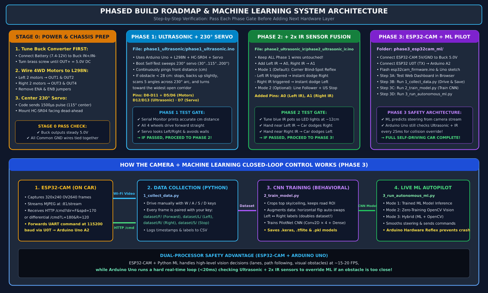

# 4WD Autonomous Car — Phased Build Guide, No-Breadboard Schematic & Machine Learning Pipeline

---

## 📥 CLONE THIS AND GET RUNNING (3 commands)

Everything is already on GitHub and verified, so you can clone it right now:

```bash
git clone https://github.com/Jaganravi131/autonomous_car.git
cd autonomous_car
python3 tools/verify_build.py      # optional: proves your copy is intact → "18 passed, 0 failed"
```

**Then do these 4 things, in this order:**

| # | Do this | How | You'll know it worked |
|:--:|---|---|---|
| **1** | Upload the **Uno** sketch | Arduino IDE → open `complete_car/complete_car.ino` → board *Arduino Uno* → **Upload** | Serial Monitor (9600) prints the banner + `--- BOOT SELF TEST ---` with your servo sweep and a distance in cm |
| **2** | Flash the **ESP32-CAM** | Arduino IDE → open `phase3_esp32cam_ml/esp32cam_firmware/esp32cam_firmware.ino` → board *AI Thinker ESP32-CAM* → `GPIO0→GND`, Upload, **remove that wire**, press RST | The Uno's Serial Monitor echoes `[CAM] Camera OK` and `[CAM] [WiFi] Join Wi-Fi "AutonomousCar-CAM"` + a dashboard URL |
| **3** | Open the **dashboard** | Join Wi-Fi `AutonomousCar-CAM` (password `12345678`) → browse to the URL from step 2 | Live video + the DRIVING MODE buttons |
| **4** | Pick a **mode** and drive | Press **MANUAL** (it lights green) → hold **▲ Forward** | Wheels turn (lift them off the desk on USB power) |

**Before flashing the ESP32, edit two lines** at the top of `esp32cam_firmware.ino` if you want it on your home Wi-Fi instead of its own hotspot:
```cpp
const char* WIFI_SSID = "YOUR_WIFI_NAME";
const char* WIFI_PASS = "YOUR_WIFI_PASSWORD";
```
Leave them alone and it simply creates its own `AutonomousCar-CAM` network — which is actually easier and works anywhere.

> **Only 1 extra wire is needed to connect the two boards:** ESP32-CAM `U0T` → Arduino `A2`. That single wire is what makes the dashboard buttons reach the car.

---

## ⭐ START HERE (read this part only, ignore the rest until you need it)

**Your job in this project = program the board + the ML model on the laptop.**
Everything below works with a **laptop + USB cable only**. You do *not* need the battery, the switch, or a breadboard to do your part.

### THE ONE FILE YOU SHOULD USE
### 👉 [`complete_car/complete_car.ino`](complete_car/complete_car.ino)

It is the whole car in one single program: **230° servo + ultrasonic + 2x IR + 4WD motors + ESP32-CAM/ML input**. Upload it once and it has **4 modes** you switch by typing in the Serial Monitor (9600 baud):

| Key | Mode | What happens | Needs battery? |
|:--:|---|---|:--:|
| **`M`** | **MANUAL** | You drive with the keyboard: `w a s d q e b s` | only to see motors move |
| **`A`** | **AUTO** | Car drives itself with servo radar + ultrasonic + 2 IR | only to see motors move |
| **`C`** | **CAMERA / ML** | **Your laptop ML model drives the car**; ultrasonic + IR act as a hard safety override | yes, for real driving |
| **`S`** | **STOP** | Motors off right now | no |

> The 4 separate phase sketches still exist as *practice steps* (`phase1_...`, `phase2_...`, `phase3_...`). If you feel confused by them, **just use `complete_car.ino`** — it does everything they do, together, in one file.

### 🎮 THE CONTROLLER DASHBOARD — where you change the mode

There are **two places** you switch modes. Both work at the same time:

| Place | How | Best for |
|---|---|---|
| **Web dashboard** on your phone/laptop | Open `http://192.168.4.1/` (or the IP the Serial Monitor prints) → press the **DRIVING MODE** buttons | Driving the car around the room from your phone |
| **Arduino Serial Monitor** (9600 baud) | Type `M`, `A`, `C` or `S` and press Enter | Bench testing, and reading the debug text |



**The dashboard has four DRIVING MODE buttons — `MANUAL`, `AUTO`, `CAMERA / ML`, and `STOP ALL`.**
The active one is lit **green** so you always know which mode the Arduino is *really* in (it reads the live `/status` telemetry every 500 ms).

⚠️ **That green highlight needs the one optional telemetry wire:** Arduino `A3` → [1 kΩ] → ESP32-CAM `IO13`, plus 2 kΩ from `IO13` to GND. Without it the buttons still work perfectly, you just don't get the green confirmation. See the [pin table](#3-master-pin-to-pin-connection-table).

| Mode button | Sends | What the car does |
|---|---|---|
| 🕹 **MANUAL — I drive (M)** | `~M\n` | Waits for your movement buttons / `w a s d q e b` keys |
| 🤖 **AUTO — sensors drive (A)** | `~A\n` | Servo radar + ultrasonic + 2 IR drive it themselves. **Movement buttons do nothing in this mode** — that's correct, the sensors are in charge |
| 🧠 **CAMERA / ML — laptop drives (C)** | `~C\n` | Your Python model drives via `/cmd?c=…`; ultrasonic + IR override it within 20 cm |
| ■ **STOP ALL (S)** | `~S\n` | Motors off immediately |

> **Why you must press a MODE button first:** after upload the car is in **STOP**. In `AUTO` the movement buttons are deliberately ignored. Press **MANUAL** before you expect the arrows to work.

### 🧠 The dashboard is built for ML development too

Beyond the controls, the dashboard is designed to be your **ML workbench**:

- **Live ML panel** — when `3_run_autonomous_ml.py` is driving, the dashboard shows the model's **prediction letter and confidence bar in real time**, so you can watch what your network is thinking as the car moves. Press **CAMERA / ML** and run:
  ```bash
  python3 phase3_esp32cam_ml/ml_pipeline/3_run_autonomous_ml.py --ip 192.168.4.1 --mode hybrid
  ```
- **Push your own predictions** from any of your scripts — the dashboard will display them:
  ```python
  requests.get(f"http://{ip}/ml", params={"p": "F", "c": 94}, timeout=0.3)
  ```
  `p` = predicted command (`F G I L R B S`), `c` = confidence 0–100.
- **A "FOR ML DEVELOPMENT" panel** on the page lists every URL with the correct IP filled in: the MJPEG stream for OpenCV, `/capture` for single frames, `/cmd`, `/status` and `/ml`.
- **`/status` returns one JSON object** with everything — telemetry and ML together:
  ```json
  {"link":true,"dist":37,"irL":0,"irR":1,"mode":1,"speed":165,"age":100,
   "ml":true,"mlPred":"F","mlConf":94,"mlAge":200}
  ```
- **Fully self-contained** — no CDN, no internet needed. The ESP32's own hotspot has no web access, so every byte of CSS/JS is inline.

The design is dark, card-based and **phone-first**, since driving the car from your phone is the main use case. Hold a direction button to drive, release to brake.

### WHAT YOU CAN DO **TODAY**, SITTING AT YOUR LAPTOP (no battery, no switch, no breadboard)

| # | What | Setup | Works? |
|:--:|---|---|:--:|
| **1** | **Test the 230° servo + ultrasonic radar** | Uno on USB → servo `SIG`→`D10`, `VCC`/`GND`; HC-SR04 `TRIG`→`D8`, `ECHO`→`D9` | ✅ **100%** |
| **2** | **Test + calibrate the 2 IR sensors** | Uno on USB → IR `OUT`→`A0`/`A1`, `VCC`/`GND` + turn the blue pot | ✅ **100%** |
| **3** | **Flash the ESP32-CAM and watch its live video** | Uno on USB used as the programmer (see Step 3A-0), then `http://192.168.4.1` | ✅ **100%** |
| **4** | **Train the ML model on the laptop** | `python3 1_collect_data.py --simulate` → `python3 2_train_model.py` | ✅ **100%** |
| **5** | **Collect REAL camera data** | ESP32-CAM powered from the Uno's `5V` (USB) → hold it and steer along your track with `w/q/e/a/d` | ✅ **100%** (motors not needed!) |
| **6** | **Check motor wiring / directions** | Uno `5V` → L298N `+12V` terminal, wheels **lifted off the table**, type `M` then `w`/`a`/`d` | ⚠️ works, but **lift the wheels** |
| **7** | **Real autonomous driving on the floor** | Needs the **battery + switch** from your friends | ⏳ later |

**Why #6 needs the wheels lifted:** the Uno's USB port can safely give about **500 mA**, and 4 motors stalled on the floor pull far more than that. On the bench with wheels spinning free they only pull ~280 mA, so it works — but keep the car raised, and never push the speed higher than `5`.

### WHAT WAITS FOR YOUR FRIENDS (battery + switch)
- Actually driving on the floor with all 4 motors under load.
- Running the full AUTO or ML mode as a real moving car.
- Anything that needs the Buck Converter (ESP32-CAM on battery instead of USB).

**Cheap fix if you don't want to wait:** a 4×AA battery holder + a slide switch costs almost nothing, or an old **5V 2A phone charger** can power the L298N `+12V` screw terminal for bench tests (replace the switch by simply plugging/unplugging it).

---


A complete, phased engineering implementation for your **4WD Autonomous Car** using your exact hardware components:
- **Arduino Uno R3** (Real-time motor & sensor safety controller)
- **L298N Dual H-Bridge Motor Driver** + **4x DC Gear Motors with 4WD Chassis**
- **1x HC-SR04 Ultrasonic Sensor**
- **1x 230° Rotation Servo Motor** (Radar pan mount for the Ultrasonic sensor)
- **2x IR Obstacle / Line Sensor Modules**
- **1x ESP32-CAM (OV2640 Camera + Wi-Fi SoC)**
- **1x DC-DC Buck Converter (LM2596)**

---

## 1. Visual Wiring Schematic & Phased Architecture

### Full Breadboard-Less Wiring Schematic


### Phased Build Roadmap & ML Closed-Loop Architecture


---

## 2. Can We Build This Without a Breadboard? (YES — And It's Better!)

A breadboard is **not recommended** on a moving 4WD robot car because vibrations shake jumper pins loose and breadboard strips drop voltage when the **230° Servo** and **ESP32-CAM** draw current spikes (600–900 mA).

Here is how every wire connects **with zero breadboard**:

1. **All Signal Wires Are Direct 1-to-1 Connections**:
   - Every sensor and driver signal pin (`IN1–IN4`, `ENA`, `ENB`, `TRIG`, `ECHO`, `SERVO`, `IR_LEFT`, `IR_RIGHT`, `ESP32 U0T`) goes directly from the module pin to its dedicated **Arduino Uno header pin** using a single **Female-to-Male DuPont jumper wire**.
2. **Use Screw Terminals as Power Clamps**:
   - Your **L298N Motor Driver** (`+12V`, `GND`, `+5V`) and **Buck Converter** (`IN+`, `IN-`, `OUT+`, `OUT-`) have screw terminals or solder pads. A single screw terminal can tightly clamp **3 to 4 stripped wire ends together** without a breadboard.
3. **Use the Arduino Uno's Extra ICSP `5V` & `GND` Pins**:
   - In addition to the main Power header (`1x 5V`, `3x GND`), the **6-pin ICSP header** (on the right side of the Arduino Uno board) has **1 extra `+5V` male pin (Pin 2)** and **1 extra `GND` male pin (Pin 6)** that accept Female jumper connectors directly!
4. **Make a Simple 5V & GND Y-Splice Power Harness (Best Practice)**:
   - Cut one end off 6 Red jumper wires (`+5V`), strip 1 cm of insulation, twist all 6 bare copper ends together, and clamp them into the **Buck Converter `OUT+ (5.0V)`** (or wrap tightly with electrical tape).
   - Repeat with 6 Black jumper wires (`GND`) connected to **Buck Converter `OUT- (GND)`** and **Arduino `GND`**.
   - Now you have a vibration-proof 5-way `+5.0V` and `GND` distribution harness for your **230° Servo, HC-SR04, 2x IR Sensors, ESP32-CAM, and Arduino Uno**.

---

## 3. Master Pin-to-Pin Connection Table

> **Why Motor PWM (`ENA`, `ENB`) is on `D5` and `D6`:**  
> On Arduino Uno, `<Servo.h>` uses hardware **Timer1**, which disables `analogWrite()` PWM on pins `D9` and `D10`. Putting `ENA` and `ENB` on **`D5` and `D6` (Timer0)** ensures your 4WD motor speed control works smoothly alongside the 230° servo!

| Component | Module Pin | Connects To | Phase Added | Notes |
| :--- | :--- | :--- | :---: | :--- |
| **Battery Pack (7.4V–12V)** | `+` (Red) | Switch → L298N `+12V` & Buck `IN+` | Stage 0 | Main motor & buck input power |
| **Battery Pack (7.4V–12V)** | `-` (Black) | L298N `GND`, Buck `IN-`, Common `GND` | Stage 0 | **All GNDs must be connected together** |
| **Buck Converter (LM2596)** | `OUT+` | **+5.0V Harness Rail** | Stage 0 | **Tune screw to 5.0V BEFORE connecting!** |
| **Buck Converter (LM2596)** | `OUT-` | **Common GND Rail** | Stage 0 | Common ground reference |
| **Left 2 Motors (FL + RL)** | Red / Black | L298N `OUT1` & `OUT2` | Phase 1 | Wire Front-Left & Rear-Left in parallel |
| **Right 2 Motors (FR + RR)**| Red / Black | L298N `OUT3` & `OUT4` | Phase 1 | Wire Front-Right & Rear-Right in parallel |
| **L298N Motor Driver** | `IN1` | Arduino **`D2`** | Phase 1 | Left motors forward |
| **L298N Motor Driver** | `IN2` | Arduino **`D3`** | Phase 1 | Left motors backward |
| **L298N Motor Driver** | `IN3` | Arduino **`D4`** | Phase 1 | Right motors forward |
| **L298N Motor Driver** | `ENA` | Arduino **`D5` (PWM)** | Phase 1 | Remove 5V jumper cap on `ENA` |
| **L298N Motor Driver** | `ENB` | Arduino **`D6` (PWM)** | Phase 1 | Remove 5V jumper cap on `ENB` |
| **L298N Motor Driver** | `IN4` | Arduino **`D7`** | Phase 1 | Right motors backward |
| **HC-SR04 Ultrasonic** | `VCC` / `GND`| `+5.0V Rail` / `Common GND` | Phase 1 | Mounted on top of 230° servo |
| **HC-SR04 Ultrasonic** | `TRIG` | Arduino **`D8`** | Phase 1 | Ultrasonic trigger pulse |
| **HC-SR04 Ultrasonic** | `ECHO` | Arduino **`D9`** | Phase 1 | Ultrasonic echo input |
| **230° Rotation Servo** | `SIG` (Org/Ylw)| Arduino **`D10`** | Phase 1 | `1500 µs` pulse = **`115°` physical center** |
| **230° Rotation Servo** | `VCC` / `GND`| **Buck `+5.0V Rail`** / `Common GND` | Phase 1 | Power from Buck 5V (not Arduino 5V!) |
| **Left IR Sensor** | `OUT` | Arduino **`A0`** | Phase 2 | Front-left corner obstacle / line sensor |
| **Right IR Sensor** | `OUT` | Arduino **`A1`** | Phase 2 | Front-right corner obstacle / line sensor |
| **Left & Right IR Sensors** | `VCC` / `GND`| `+5.0V Rail` / `Common GND` | Phase 2 | Tune blue pot so green LED lights at ~12 cm |
| **ESP32-CAM** | `5V` / `GND` | **Buck `+5.0V Rail`** / `Common GND` | Phase 3 | Needs stable 5.0V from Buck Converter |
| **ESP32-CAM** | `U0T (GPIO1)`| Arduino **`A2` (SoftSerial RX)** | Phase 3 | **1 direct wire** (3.3V TX → 5V RX is safe!) |
| **ESP32-CAM** *(Optional)* | `IO13` | Arduino **`A3` (SoftSerial TX)** | Phase 3 | Live telemetry for the dashboard. **`A3` --1kΩ--> `IO13`, plus 2kΩ `IO13`→GND.** Uses IO13 (SD-card pin, unused here) so the flashing pins `GPIO1/GPIO3` stay free. |

### 🔌 How the Arduino and the ESP32-CAM actually talk to each other

This is the part that confuses everyone, so here it is step by step. **Only 2 wires** connect the two boards (1 is optional).

```
        YOUR PHONE / LAPTOP                       ESP32-CAM                    ARDUINO UNO
   ┌──────────────────────────┐            ┌──────────────────────┐      ┌────────────────────┐
   │  Browser: dashboard      │            │                      │      │                    │
   │  http://192.168.4.1/     │── Wi-Fi ──▶│  web server  :80     │      │                    │
   │                          │            │  video stream :81    │      │                    │
   │  press MANUAL / Forward  │── HTTP ───▶│  GET /cmd?c=F        │      │                    │
   └──────────────────────────┘            │        │             │      │                    │
                                           │        ▼             │      │                    │
                                           │   Serial.write       │      │                    │
                                           │   '~'  'F'  '\n'     │═════▶│  A2  (SoftSerial)  │
                                           │                      │ wire │  → drives motors   │
                                           │   /status  ◀─────────│══════│  A3  (telemetry)   │
                                           │        ▲             │ wire │                    │
                                           └──────────────────────┘      └────────────────────┘
                                                                          (optional, via divider)
```

**The full round trip when you press "▲ Forward" on your phone:**

1. **Browser** → `GET /cmd?c=F` over Wi-Fi to the ESP32-CAM.
2. **ESP32** wraps it in a frame and writes 3 bytes out of `U0T (GPIO1)`: `~` `F` `\n`.
3. That travels down **one wire** into the Uno's **`A2`** pin (SoftwareSerial at 9600 baud).
4. The Uno's `handleCamChar()` sees the `~`, knows a real command is coming, reads `F`, and maps it → forward. Motors spin.
5. Every 500 ms the Uno writes back on **`A3`**: `#D:37,L:0,R:1,M:1,V:165\n` = distance 37 cm, left clear, right blocked, **mode 1 (MANUAL)**, speed 165.
6. The ESP32 parses that into `/status` as JSON, and the browser lights the **MANUAL** button green.

**Three details that matter:**

| Question | Answer |
|---|---|
| Why is a `~` needed? | The ESP32 also prints its boot logs and debug text on that same wire. Text like `[CAM] Streaming...` contains **C, A, M, S** — which the old code read as mode changes and STOP. Framing means debug text can never steer the car. There is also a 3-second grace period that ignores the boot burst entirely. |
| Why `A2`/`A3` and not the Uno's hardware RX/TX (`D0`/`D1`)? | Because `D0`/`D1` are the Uno's USB pins. If the ESP32 used them you could not use the Serial Monitor or upload code while the camera is connected. |
| Why does telemetry use `IO13` instead of the ESP32's `GPIO3`? | `GPIO1`/`GPIO3` (`U0T`/`U0R`) are the ESP32's **flashing pins**. Using `IO13` means you never have to disconnect anything to re-flash the camera. `IO13`/`IO14` are normally the SD-card pins, and this project doesn't use the SD card. |
| Is 3.3 V → 5 V safe? | Yes, one-way: the ESP32's **3.3 V output** is above the Uno's ~2.5 V "high" threshold, so `U0T → A2` needs no level shifter. The **other** direction is not safe — that's why `A3 → IO13` needs the 1 kΩ / 2 kΩ divider to drop 5 V down to ~3.3 V. |

---

## 4. Step-by-Step Phased Roadmap & Testing Protocol

### Stage 0: Power Calibration & Mechanical Setup (10 Minutes)
1. **Adjust Buck Converter FIRST**: Connect only the Battery (`7.4V–12V`) to Buck `IN+` and `IN-`. Measure `OUT+` and `OUT-` with a multimeter and turn the small brass potentiometer screw until the output reads **`5.0V – 5.1V DC`**.
2. **230° Servo Center Alignment**: Unlike a standard 180° servo (where center is 90°), your **230° servo's physical center is `115°`** (`1500 µs` pulse). Our code uses `writeServo230(115)` to move to `1500 µs`. Let the servo move to center in Phase 1 `setup()` before screwing the ultrasonic sensor horn on so it points dead-ahead.

---

### Phase 1: Ultrasonic + 230° Servo Radar Obstacle Avoidance
- **Arduino Sketch**: [`phase1_ultrasonic/phase1_ultrasonic.ino`](phase1_ultrasonic/phase1_ultrasonic.ino)
- **What It Does**:
  1. Runs a **Startup Self-Test** on boot: centers the 230° servo at `115°`, sweeps Right (`65°`) → Left (`165°`) → Center (`115°`), and prints initial Ultrasonic distance (cm) to Serial Monitor (`9600` baud).
  2. Drives forward at cruise speed (`PWM = 165`), slowing smoothly (`PWM = 125`) when an object is between `28 cm` and `45 cm`.
  3. When an obstacle is `< 28 cm`, stops, reverses briefly, sweeps the 230° servo across **5 radar angles (`30°, 65°, 115°, 165°, 200°`)**, and turns toward the widest open corridor.
- **Phase 1 Pass Checklist (Verify before moving to Phase 2)**:
  - [ ] Open Arduino IDE Serial Monitor at `9600` baud: distance readings match a ruler in front of HC-SR04.
  - [ ] All 4 wheels spin **forward** when path is clear (if one side spins backward, swap its two motor wires on `OUT1/OUT2` or `OUT3/OUT4`).
  - [ ] Placing your hand `< 25 cm` in front of the sensor makes the car stop, scan Left/Right with the 230° servo, and turn away.

---

### Phase 2: Ultrasonic + 230° Servo + 2x IR Sensor Fusion
- **Arduino Sketch**: [`phase2_ultrasonic_ir/phase2_ultrasonic_ir.ino`](phase2_ultrasonic_ir/phase2_ultrasonic_ir.ino)
- **Hardware Addition**: Keep **all Phase 1 wires untouched**. Plug Left IR `OUT` into **`A0`** and Right IR `OUT` into **`A1`**.
- **What It Does**:
  - **Mode 1 (`MODE_OBSTACLE_FUSION`, Default)**: Ultrasonic waves have blind spots on sharp-angled walls and thin chair legs at the front wheel corners. The 2x IR sensors angled at ~35° on the front-left and front-right corners act as **zero-latency reflex bumpers**:
    - Left IR triggered → Instant reflex dodge Right (`240 ms`) without waiting for a servo scan.
    - Right IR triggered → Instant reflex dodge Left (`240 ms`).
    - Both IRs triggered OR Ultrasonic `< 28 cm` → Full stop, reverse, and 5-angle 230° servo radar scan.
  - **Mode 2 (`MODE_LINE_AND_OBSTACLE`)**: Set `#define OPERATING_MODE MODE_LINE_AND_OBSTACLE` at line 27 if pointing the 2x IR sensors downward at a black floor line.
- **Phase 2 Pass Checklist (Verify before moving to Phase 3)**:
  - [ ] Adjust the small blue potentiometer on each IR sensor so its onboard green indicator LED turns ON only when your hand is within `~10–15 cm`.
  - [ ] Waving your hand near the front-left wheel makes the car immediately dodge right; waving near the front-right wheel makes it dodge left.

---

### Phase 3: ESP32-CAM + Machine Learning Autonomous Control
Once Phase 1 and Phase 2 pass, your hardware platform is 100% verified. Now add the **ESP32-CAM** as the visual brain while the **Arduino Uno** stays active as a **hard real-time safety reflex controller**:

#### Step 3A-0: Bench-Test the ESP32-CAM ALONE First (No Buck Converter, No Sensors!)

**Direct answers to the three questions:**

| Question | Answer |
| :--- | :--- |
| **Can I train the ML model with no hardware at all?** | ✅ **YES — 100% on your laptop.** Run `python3 1_collect_data.py --simulate` then `python3 2_train_model.py` and you get a working `models/autonomous_car_model.npz` with **no car, no ESP32-CAM, no Buck Converter**. Real accuracy needs real data, but the entire pipeline is testable today. |
| **Do I need the Buck Converter to program the ESP32-CAM with the Arduino Uno?** | ❌ **NO.** The Arduino Uno's USB cable supplies clean 5V. The Buck Converter is only needed later for **battery-only standalone operation** (see the table below). |
| **Can I do the ESP32-CAM + ML part separately, without any sensors?** | ✅ **YES, and this is the recommended order.** Flash + stream + collect ML data with **only: Arduino Uno + ESP32-CAM + L298N + 4 motors**. The ultrasonic, servo, and IR sensors are **not required for ML training** — add them last as the safety layer. |


> **Q: Do I need the Buck Converter to program the ESP32-CAM with the Arduino Uno?**  
> **A: NO — not for bench programming/testing.** The Arduino Uno's USB cable already provides 5V, which is exactly what the ESP32-CAM needs. The Buck Converter is only required later, when the car must run **standalone on the 7.4V–12V battery** with no USB cable attached.
>
> **WARNING:** Never power the ESP32-CAM from the Arduino Uno's **`3.3V` pin** — the Uno R3's onboard 3.3V regulator supplies only **~50 mA**, while the ESP32-CAM needs **250–350 mA** (Wi-Fi + camera). Always use the **`5V` pin** (the ESP32-CAM has its own onboard `AMS1117-3.3` regulator next to the 5V pin).

**Isolated Bench Wiring — Arduino Uno used as a USB-to-Serial programmer (3 signal wires only):**

```text
   ARDUINO UNO (powered by its own USB cable)          ESP32-CAM (AI-Thinker)
   ┌──────────────────────────────┐                    ┌────────────────────┐
   │  RESET ──●── to GND rail     │                    │                    │
   │  D0  (RX) ●──────────────────┼────────────────────┼──● U0R  (GPIO3)   │
   │  D1  (TX) ●──────────────────┼────────────────────┼──● U0T  (GPIO1)   │
   │  5V       ●──────────────────┼────────────────────┼──● 5V   (VCC)     │
   │  GND      ●──────────────────┼────────────────────┼──● GND            │
   └──────────────────────────────┘                    │  GPIO0 ●── to GND  │
                                                        │  RST   ●── (touch  │
                                                        └──────── to GND)    │
   GPIO0 → GND  = FLASH MODE (only while uploading code)
   GPIO0 left open = RUN MODE (required for the camera to work!)
```

**Flashing Procedure (Arduino IDE):**
1. Set **Tools → Board → `AI Thinker ESP32-CAM`**, **Upload Speed `115200`**, **Partition Scheme → `Huge APP (3MB No OTA/1MB SPIFFS)`**.
2. Wire **`GPIO0 → GND`**, then plug in the Arduino Uno's USB cable (or press the ESP32-CAM `RST` pin to GND once) — this boots the ESP32 into bootloader mode.
3. Click **Upload**. When you see `Connecting........_____`, it is flashing. (If it fails, press `RST` to GND once more while "Connecting" is scrolling.)
4. **After "Hard resetting via RST pin...": DISCONNECT the `GPIO0 → GND` wire**, then momentarily touch the ESP32-CAM `RST` pin to `GND` to reboot.
   - ⚠️ **Critical:** If you forget to remove `GPIO0 → GND`, the camera will fail with `Camera init failed with error 0x105`, because `GPIO0` is also the camera's XCLK clock pin!
5. Open **Tools → Serial Monitor @ `115200` baud** to see the ESP32-CAM print its Wi-Fi IP address.
6. Open `http://192.168.4.1` (or the printed station IP) in a browser → verify the **live video stream** and the **`/cmd?c=F` web dashboard buttons** in isolation. *(Motors will not move — nothing is connected yet.)*
7. **Now remove the `D0`/`D1`/`RESET` wires** and put the Arduino Uno back to normal use with `GPIO0` left floating.

**Recommended Isolated Test Order (do these one at a time before ever attaching sensors):**

| Test | Connect | Buck Needed? | What You Prove |
| :--- | :--- | :---: | :--- |
| **T1** | Arduino Uno + ESP32-CAM (5V, GND, D0, D1, RESET→GND) | ❌ No (USB) | You can flash the ESP32-CAM successfully |
| **T2** | Remove D0/D1/RESET, keep `5V + GND` from the Arduino Uno | ❌ No (USB) | Wi-Fi connects, `192.168.4.1` video stream works |
| **T3** | Move ESP32-CAM `5V`/`GND` to the **Buck Converter `OUT+`/`OUT-`** + Battery | ✅ **Yes** | ESP32-CAM runs standalone on battery power |
| **T4** | Add the single wire **ESP32-CAM `U0T` → Arduino `A2`** (Buck still powering ESP32) | ✅ Yes | `/cmd?c=F` reaches the Arduino (Serial Monitor prints `>> MODE = CAMERA` / motor action) |
| **T4b** *(optional)* | Add telemetry: **`A3` --1kΩ--> ESP32 `IO13`**, plus 2kΩ `IO13`→GND | ✅ Yes | The green telemetry box on the dashboard shows live distance / IR / mode |
| **T5** | Add L298N + 4 motors | ✅ Yes | Wheels actually respond to `/cmd?c=...` |
| **T6** | Add Ultrasonic + Servo + 2x IR Sensors | ✅ Yes | Full car runs like Phase 1/2, but now driven via Wi-Fi |

> **If the ESP32-CAM keeps rebooting / the stream stutters during T2:** that is a brownout from a thin or long USB cable. Try a short, thick USB cable, or move straight to T3 (Buck Converter) — the Buck Converter gives a far more stable 5.0V than a laptop USB port.
>
> **Why is the Buck Converter needed at T3 and not at T1/T2?**  
> The ESP32-CAM's `5V` pin feeds an `AMS1117-3.3` regulator, whose **maximum input is ~10V** and which dissipates the extra voltage as heat. Feeding it **7.4V–12V directly from the battery would overheat/damage it**, so the Buck Converter is mandatory for battery operation. On USB, the Arduino Uno already hands you a clean 5V — so the Buck is simply bypassed.

#### Step 3A: Flash Arduino Uno & ESP32-CAM
> **Recommended:** upload [`complete_car/complete_car.ino`](complete_car/complete_car.ino) — it is the single firmware that already contains everything (servo + ultrasonic + 2x IR + 4WD + ESP32-CAM/ML input, all 4 modes). The `arduino_ml_controller.ino` below is the smaller "ML-only" version if you prefer to keep it separate.

1. **Flash Arduino Uno**: Upload [`complete_car/complete_car.ino`](complete_car/complete_car.ino) **or** [`phase3_esp32cam_ml/arduino_ml_controller/arduino_ml_controller.ino`](phase3_esp32cam_ml/arduino_ml_controller/arduino_ml_controller.ino) to your Arduino Uno.
   - Because ESP32-CAM connects to `A2` (`SoftwareSerial RX`) instead of `D0/D1`, you **never have to unplug wires** to upload code!
2. **Flash ESP32-CAM**: Open [`phase3_esp32cam_ml/esp32cam_firmware/esp32cam_firmware.ino`](phase3_esp32cam_ml/esp32cam_firmware/esp32cam_firmware.ino), set your `WIFI_SSID` and `WIFI_PASS` (or leave as default to use its built-in Wi-Fi Access Point `AutonomousCar-CAM`, password `12345678`, IP `192.168.4.1`), select board **`AI Thinker ESP32-CAM`**, and upload.
3. **Connect the 1 Signal Wire**: Connect **ESP32-CAM `U0T (GPIO1)` → Arduino Uno `A2`**, plus `5V` and `GND` from the Buck Converter.
4. **Browser Test**: Open `http://192.168.4.1` (or the station IP printed on Serial) in your browser. Verify live video streaming and drive the car with `W/A/S/D` or on-screen buttons!

#### Step 3A-1: How do I know the CAMERA is connected, and WHERE do I see the video?

There are **four independent ways** to confirm the camera works. Work down the list — each one needs the previous to be true.

| # | Where to look | What you should see | If it fails |
|:--:|---|---|---|
| **1** | **Arduino Serial Monitor** (`9600` baud) — the Uno echoes everything the ESP32 says, prefixed with `[CAM]` | `[CAM] ===== 4WD Autonomous Car - ESP32-CAM =====` then `[CAM] Camera OK` then `[CAM] [WiFi] Join Wi-Fi "AutonomousCar-CAM"` and the dashboard URL | `Camera init FAILED, error 0x105` → the `GPIO0 → GND` wire is still attached. Remove it and press the ESP32 `RST`. |
| **2** | **Phone / laptop Wi-Fi list** | A network named **`AutonomousCar-CAM`** (password `12345678`) | ESP32 not powered, or it joined your home Wi-Fi instead (then use the IP printed in `[CAM] [WiFi] Connected. Dashboard: http://…`) |
| **3** | **Browser** → `http://192.168.4.1/` | The **dashboard**: live video + buttons + the green telemetry box | Video box empty → open `http://192.168.4.1:81/stream` directly; if that also fails, the camera never initialised (back to row 1) |
| **4** | **Terminal** → `curl -s -o test.jpg http://192.168.4.1/capture` then open `test.jpg` | A single saved JPEG photo | Same as row 3 |

**Every address the project exposes** (handy when you write your own ML scripts):

| URL | What it gives you |
|---|---|
| `http://192.168.4.1/` | The control dashboard |
| `http://192.168.4.1:81/stream` | MJPEG video — what OpenCV opens in `cv2.VideoCapture(...)` |
| `http://192.168.4.1/capture` | One still JPEG frame |
| `http://192.168.4.1/cmd?c=F` | Send a driving command (`F G I L R B S`, modes `M A C`, speed `1`–`9`) |
| `http://192.168.4.1/status` | JSON: `link, dist, irL, irR, mode, speed, age, ml, mlPred, mlConf, mlAge` |
| `http://192.168.4.1/ml?p=F&c=94` | Push a model prediction so the dashboard displays it |

> **The Uno echoing the ESP32's messages is deliberate.** Because the ESP32's TX wire goes into the Uno's `A2`, and the Uno prints what it receives onto its own USB Serial Monitor, **your Arduino Serial Monitor becomes the ESP32's debug console.** That is how you read the ESP32's IP address and camera errors without buying a USB-TTL adapter.

**The dashboard now also shows live telemetry** (green box): distance in cm, both IR sensors, the Uno's current mode and speed — read from the Arduino over the optional `A3 → IO13` wire. Without that wire it shows *"No telemetry from the Arduino… The car still drives fine without it."*

#### Step 3B: Collect Your Training Dataset (`1_collect_data.py`)
Drive the car manually around your room/track using your laptop keyboard (`W`=Forward, `Q`=Gentle Left, `E`=Gentle Right, `A`=Spin Left, `D`=Spin Right, `S`=Stop) while the script automatically saves labeled camera frames into `dataset/<COMMAND>/`:
```bash
cd phase3_esp32cam_ml/ml_pipeline
pip install -r requirements.txt

# Collect live labeled frames from ESP32-CAM while driving with W/Q/E/A/D/S keys:
python3 1_collect_data.py --ip 192.168.4.1 --dataset dataset

# Or generate a synthetic road dataset to test the ML training pipeline offline:
python3 1_collect_data.py --simulate --dataset dataset --samples 180
```

#### Step 3C: Train the Neural Network (`2_train_model.py`)
Trains a neural network on your collected dataset with **Region-of-Interest (ROI) cropping** (removes top 35% ceiling/clutter) and **Horizontal Mirror Augmentation** (flips images horizontally and automatically swaps `Left ↔ Right` steering labels, doubling your dataset):
```bash
python3 2_train_model.py --dataset dataset --model-dir models --epochs 35
```
- Saves portable weights to `models/autonomous_car_model.npz` (and `models/autonomous_car_cnn.keras` if TensorFlow is installed).

#### Step 3D: Run Real-Time Autonomous ML Pilot (`3_run_autonomous_ml.py`)
```bash
# 1. Hybrid Mode (Recommended: 75% Trained Neural Network + 25% Computer Vision + EMA Smoothing):
python3 3_run_autonomous_ml.py --ip 192.168.4.1 --model models/autonomous_car_model.npz --mode hybrid

# 2. Pure Trained ML Model Mode:
python3 3_run_autonomous_ml.py --ip 192.168.4.1 --model models/autonomous_car_model.npz --mode ml

# 3. Zero-Training Computer Vision Mode (Works immediately before collecting any dataset!):
python3 3_run_autonomous_ml.py --ip 192.168.4.1 --mode vision
```

> **Dual-Processor Safety Guarantee**: Even while the Python ML script is steering the car via ESP32-CAM Wi-Fi commands, the **Arduino Uno** checks the **HC-SR04 Ultrasonic Sensor (`< 20 cm`)** and **2x IR Corner Sensors (`A0`, `A1`)** every 15 milliseconds. If Wi-Fi lags (`> 900 ms` watchdog) or the ML model commands the car toward a wall, the Arduino Uno immediately overrides the command to prevent a collision!

---

## 5. How To Train The ML Model — Exact Steps, And What You Will See

Everything here runs **on your laptop only**. No car, no battery, no sensors required. Open a terminal:

```bash
cd phase3_esp32cam_ml/ml_pipeline
pip install -r requirements.txt      # opencv-python, numpy, requests, pillow, scikit-learn

# ---- STEP 1: get a dataset -------------------------------------------------
# A) quick test with NO hardware (synthetic road images) - takes ~5 seconds:
python3 1_collect_data.py --simulate --dataset dataset --samples 180

# B) real data from the ESP32-CAM (this is what you actually want):
#    hold the camera / carry the car along your track and press keys to record
python3 1_collect_data.py --ip 192.168.4.1 --dataset dataset
```
**What you see for (B):** a window titled *ESP32-CAM Data Collector* showing live video with a HUD:
`CMD: F | REC: ON | Saved: 143`. Drive with **`w`** forward, **`q`**/**`e`** gentle curves, **`a`**/**`d`** sharp turns, **`s`** stop.
Frames are saved automatically into `dataset/F/`, `dataset/G/`, …… at ~8 per second, logged in `dataset/driving_log.csv`.
Press **`r`** to pause recording, **`ESC`** to quit.

```bash
# ---- STEP 2: train --------------------------------------------------------
python3 2_train_model.py --dataset dataset --model-dir models --epochs 35
```
**What you see:**
```
[1/3] Loading and augmenting dataset from 'dataset/'...
      Loaded 360 total samples (including mirror augmentation) of shape (36, 48, 3)
[2/3] Training Neural Network (288 train, 72 validation)...
  Epoch 05/35 — Train Acc:  95.1% | Val Acc:  95.8%
  Epoch 10/35 — Train Acc:  99.0% | Val Acc:  97.2%
  ...
  Epoch 35/35 — Train Acc: 100.0% | Val Acc: 100.0%
[3/3] Saved portable Neural Network weights -> models/autonomous_car_model.npz
```
*"Loaded 360 total samples"* from 180 collected images — the mirror augmentation doubles it by flipping each image and swapping Left↔Right labels.
**Val Acc** is the number that matters. **Below ~70%**: collect more frames, drive more smoothly, keep the car centred on the track while recording.

```bash
# ---- STEP 3: check the model BEFORE letting it drive ----------------------
python3 3_run_autonomous_ml.py --test-on-dataset dataset --model models/autonomous_car_model.npz --mode hybrid
```
**What you see:** `Evaluated 180 road frames in 388.4 ms (463.5 FPS)` and `Classification Accuracy: 180/180 (100.0%)`.
This offline benchmark is your safety gate — if accuracy is poor here, **do not** put the car on the floor yet.

```bash
# ---- STEP 4: let the model drive the car ---------------------------------
python3 3_run_autonomous_ml.py --ip 192.168.4.1 --model models/autonomous_car_model.npz --mode hybrid
```
**What you see:** a window *Autonomous Car — Live ML Autopilot* with `MODE: HYBRID | PRED: F (94%)`. Press **`ESC`** to stop (the script then sends `S` to the car).
The Uno's ultrasonic + IR sensors stay active the whole time and **override** the model within 20 cm, so a bad prediction cannot cause a crash.

| Mode | What it uses | When to use it |
|---|---|---|
| `--mode ml` | only your trained network | after you have a good dataset |
| `--mode vision` | zero-training OpenCV heuristics | **before** collecting any data — try it first |
| `--mode hybrid` | 75% network + 25% vision | the recommended default |

---

## 6. Is The Arduino Code Complete And Correct? (verification report)

I cannot put your hardware on a bench, so here is exactly **what has been proven** and **what only real hardware can prove**.

### ✅ Proven by machine (reproducible, not opinion)

| Check | Result |
|---|---|
| All 4 sketches compile with `-Wall -Wextra` (no warnings) | ✅ pass |
| `complete_car.ino` runs `setup()` + `loop()` headless without crashing | ✅ pass |
| 13-case behaviour test suite (modes, framing, telemetry format, grace period) | ✅ **13/13 pass** |
| Motor outputs asserted: `w` sets ENA>0 **and** ENB>0; `s` sets both to 0 | ✅ pass |
| Cross-check: Uno telemetry output ↔ ESP32 parser agree exactly | ✅ pass |
| Dashboard JavaScript syntax (`node --check`) | ✅ pass |
| Every called function is defined; braces/parens balanced | ✅ pass |

**Re-run these checks yourself at any time — one command, no hardware needed:**
```bash
python3 tools/verify_build.py
# → RESULT: 18 passed, 0 failed   (the 1 skip is the ESP32 sketch, which needs the Arduino IDE)
```
It re-checks the sketch folder rules, compiles all sketches, runs the whole ML pipeline, verifies every README link, and confirms the pin numbers in the wiring table still match `complete_car.ino`.

### ⚠️ Requires real hardware to confirm (do these on the bench first)

1. **Motor direction polarity** — if a side runs backwards, swap that pair's two wires on `OUT1/OUT2` or `OUT3/OUT4`. This is wiring, not code.
2. **IR modules: active-low vs active-high** — the boot self-test prints `Left IR sensor : OBSTACLE/clear` with an empty floor. If it says OBSTACLE with nothing there, set `#define IR_ACTIVE_LOW 0`.
3. **Servo direction** — if the radar sweeps the wrong way, swap the values in `RADAR_ANGLES[]`.
4. **Ultrasonic accuracy** — compare the printed cm against a ruler.

### 🐛 A real bug that WAS found and FIXED in this revision

The ESP32-CAM prints debug text on the very same wire it sends commands on. Text like `[CAM] Streaming...` contains the letters **C, A, M, S** — and the previous version of the Uno code accepted those as **mode changes and STOP**, and `rst:0x1 (POWERON_RESET)` contains **R** (spin right!). **Symptoms you would have seen:** random mode switching, the car stopping or twitching for no reason, especially right after power-up.

**Fix:** commands are now wrapped in a frame — `'~'` + letter + newline (`~F\n`). The Uno ignores *everything* outside a frame, so boot logs and debug text can never steer the car. There is also a 3-second grace period that swallows the ESP32's boot burst entirely. Both are verified by tests 1, 3, 4 and 7 above.

**Nothing changed for you at the controls:** the dashboard buttons, the `w/a/s/d` keyboard driving, and all three Python modes keep working exactly as before — the ESP32 firmware adds the `~` automatically.

---

## 7. Troubleshooting & FAQ (expert advice you may have read elsewhere)

**Q: I read that `PIN_IN2` on Pin 3 is a "critical Timer2 conflict" with the Servo library. Must I move it?**
**A: No. That advice is wrong — keep Pin 3.** Verified facts about this exact code:
- `Pin 3` is used **only** with `digitalWrite(PIN_IN2, ...)` (line 194 of `complete_car.ino`). It is **never** used with `analogWrite()` or `tone()`.
- Timer2 is only involved in PWM when you call `analogWrite(3, ...)` or `analogWrite(11, ...)`, or `tone()`. **None of those are used anywhere in this project.** A plain `digitalWrite()` and `pinMode(..., OUTPUT)` do not touch any timer at all.
- Therefore there is **zero** Timer2 involvement, and no "interrupt timing clash" is possible from Pin 3.
- The advice is also **self-contradictory**: it says Pin 3 is bad because it shares **Timer2**, then suggests moving to **Pin 11 — which is also a Timer2 PWM pin.** Moving to Pin 11 would be strictly worse, so **do not do that.**
- Why PWM lives on `D5`/`D6`: `Servo.h` takes **Timer1**, which kills `analogWrite()` (not `digitalWrite()`) on `D9`/`D10`. Putting `ENA`/`ENB` on Timer0 pins `D5`/`D6` is the actual fix, and it is already applied. `D9` is used only as a `pulseIn()` ECHO input, which uses no timer.

> If you simply *prefer* to move `IN2` off Pin 3 for peace of mind, use **`D12`** (a plain digital pin with no timer, no PWM, no SPI use) — **never `D11`**. It is a 1-line change plus 1 wire; nothing else in the project breaks. Ask and it will be updated everywhere (sketches + schematic + table).

**Q: Does `Servo.h` + `SoftwareSerial` on `A2`/`A3` cause glitches?**
**A: No, at the 9600 baud used here.** The Servo interrupt is only a few microseconds long, while one bit at 9600 baud lasts ~104 µs — a ~30x margin. (This pairing is only risky at 115200 baud, which this project never uses.) `A2`/`A3` are `PCINT10`/`PCINT11` on the ATmega328P, which exist and work correctly for `SoftwareSerial`. If commands ever look garbled, the real cause is almost always the ESP32-CAM's 3.3V TX into the Uno's 5V RX (a valid but ~300 mV margin) — fix by keeping the wire short, or add a 2N7000/BSS138 level shifter.

**Q: Is `SELF_TEST_MOTORS` safe?**
**A: Yes, and it is already `0`.** Leave it `0` while powered by USB — a boot-time motor pulse can trip your PC's USB over-current protection. Set it to `1` only when the motor supply (battery/pack) is connected.

**Q: My car reverses when the room is empty — is the IR logic backwards?**
**A: Maybe — change `#define IR_ACTIVE_LOW 1` to `0`.** Most IR modules output LOW on detection (`1`), but a few do the opposite. You can also see this instantly in the boot self-test output (`Left IR sensor : OBSTACLE/clear` with an empty floor).

---

## 8. Repository Structure

```text
autonomous_car/
├── README.md                                                 # Complete Roadmap, Wiring Table & ML Guide
├── complete_car/
│   └── complete_car.ino                                      # ⭐ THE ONE FILE: full car, 4 modes (M/A/C/S)
├── tools/
│   ├── verify_build.py                                       # One-command health check for the whole repo
│   └── render_preview.py                                     # Redraws dashboard_preview.png from the firmware
├── schematics/
│   ├── full_wiring_schematic.png                             # High-res Breadboard-less Wiring Schematic
│   ├── full_wiring_schematic.svg                             # Vector Wiring Schematic
│   ├── phase_roadmap_diagram.png                             # Visual Phased Roadmap & ML Architecture
│   └── phase_roadmap_diagram.svg                             # Vector Roadmap Diagram
├── phase1_ultrasonic/
│   └── phase1_ultrasonic.ino                                 # Phase 1: 4WD + Ultrasonic + 230° Servo Radar
├── phase2_ultrasonic_ir/
│   └── phase2_ultrasonic_ir.ino                              # Phase 2: + 2x IR Sensor Reflex / Line Fusion
└── phase3_esp32cam_ml/
    ├── arduino_ml_controller/
    │   └── arduino_ml_controller.ino                         # Phase 3A: Arduino UART Actuator + Safety Reflex
    ├── esp32cam_firmware/
    │   └── esp32cam_firmware.ino                             # Phase 3B: ESP32-CAM MJPEG Stream + HTTP/UART Bridge
    └── ml_pipeline/
        ├── requirements.txt                                  # Python dependencies
        ├── 1_collect_data.py                                 # Step 1: Drive & record labeled training frames
        ├── 2_train_model.py                                  # Step 2: ROI crop, mirror-augment & train NN/CNN
        ├── 3_run_autonomous_ml.py                            # Step 3: Live ML/Vision/Hybrid Autonomous Pilot
        └── models/
            └── autonomous_car_model.npz                      # Pre-trained baseline neural network weights
```
